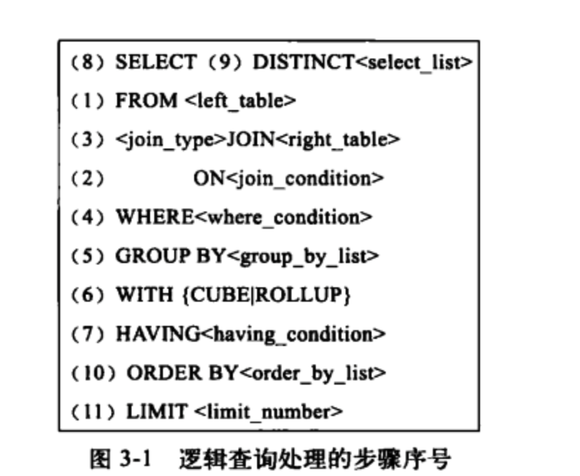
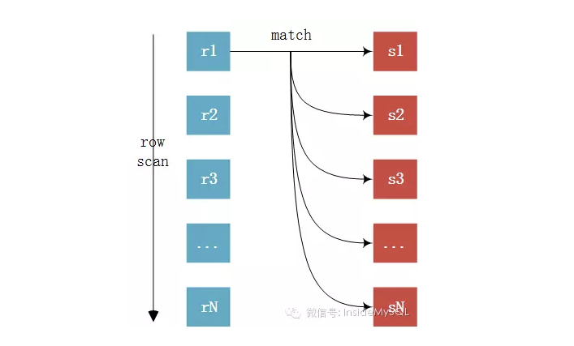
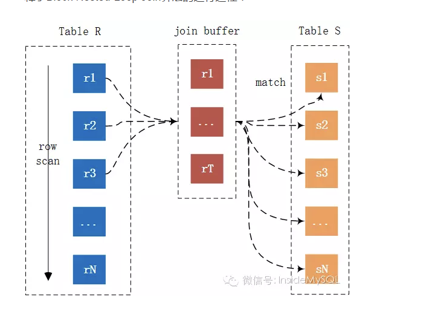

## 慢SQL优化

--- 

## 1. 先看看慢sql和慢SQL的背景

* 背景：
  * 这是一个文件同步导出的接口，前端向后端发起分页请求，然后后端根据前端请求进行分页查询，并将分页数据返回给前端，前端最终整合数据封装成一个excel文件进行导出。
  * 然后SQL的查询操作就是根据列表页面的筛选条件，筛选出符合条件的信息，并进行分页返回。

* 再说一下数据的相关信息：
    * father_table表：数据量**60w**
    * children_table表：数据量**110w**
    * **SQL执行时间 2.4s**

怎么样，乍一看这个数据量明明不大，但是为什么这个SQL会这么慢呢？？继续往下看看。
```sql
SELECT `father_table`.`filed_1`,
       `father_table`.`order_code`,
       `father_table`.`filed_2`,
       `father_table`.`filed_3`,
       `father_table`.`filed_4`,
       `father_table`.`filed_5`,
       `father_table`.`filed_6`,
       `father_table`.`order_time`,
       `father_table`.`commodity_type`,
       `father_table`.`filed_7`,
       `father_table`.`filed_8`,
       `father_table`.`filed_10`,
       `father_table`.`filed_11`,
       `children_table`.`filed_12`,
       `children_table`.`filed_13`,
       `children_table`.`filed_14`,
       `children_table`.`filed_15`,
       `children_table`.`filed_16`,
       `children_table`.`filed_17`,
       `children_table`.`filed_18`,
       `children_table`.`filed_19`,
       `children_table`.`filed_20`,
       `children_table`.`id` AS `children_table_id`
FROM `children_table`
         INNER JOIN `father_table` ON `father_table`.`order_code` = `children_table`.`order_code`
WHERE `father_table`.`commodity_type` = '1'
  AND `father_table`.`filed_21` = '1'
  AND `father_table`.`order_time` >= '2023-06-01'
  AND `children_table`.`deleted_at` IS NULL
ORDER BY `children_table`.`created_at` DESC
LIMIT 100 OFFSET 111200

```

ok，看到这个SQL后，你会有什么想法呢？加索引？where过滤？join的问题？排序？  
是不是一时不知道如何下手，没错和我一样，我在这周开始的时候也是这样的。但是我们先不说怎么解决，我们得复习一下基础知识。

这里我先告诉你答案：这个慢sql的问题是**order by** + **深度分页**

这里我就罗列出来一个大纲，但是需要你去看看其他资料，这里我只做join连表的知识梳理。 嘿嘿😁,先附上一个**SQL的执行顺序**   
    


* 下面的你得先看看👇

1. **mysql的索引类型，使用索引的时候，索引是如何帮助我们快速定位数据的**
2. **mysql的索引类型，什么时候需要回表**
3. **explain 怎么用，怎么看，看什么** （我下面也会写一点）
4. **联表的时候发生了什么** （这个我下面会来分享）
5. MySQL 优化器做了什么（这个可以了解，不用深究，但是你需要知道索引的选择是通过优化器决定的）

--- 

## 2. 概念梳理

### 表的驱动

* **驱动表**（Driving Table）：
  驱动表是联表查询中首先被读取的表。
  MySQL会从驱动表中读取数据，然后根据这些数据去非驱动表中查找匹配的记录。
  通常，驱动表应该是较小的表，或者是能够通过索引快速查找的表，以减少查询的开销。
* **非驱动表**（Driven Table）：
  非驱动表是联表查询中在驱动表之后被读取的表。
  MySQL会根据驱动表中的数据去非驱动表中查找匹配的记录。
  非驱动表通常是较大的表，或者是需要根据驱动表中的数据进行多次查找的表。
* **选择表的策略**
    * 小表驱动大表：选择较小的表作为驱动表，因为读取较小的表会减少I/O操作，从而提高查询性能。
    * 索引优先：选择有索引的表作为驱动表，这样可以利用索引快速查找数据。
    * 过滤条件：选择能够通过过滤条件减少数据量的表作为驱动表，这样可以减少后续表的查找次数。
* **解释一下**（这个可以看完下面的连表原理再来看这个，你就知道为什么驱动表要有这些约束了）：
    * 因为驱动表是要全量走的，如果有where，就会变成range或者ref，具体要看where的过滤条件有没有用到索引。
    * 所以在这个基础之上，如果驱动表越小，那么全表走的数据就越少。如果还有where，那么就可以过滤掉一部分数据，如果where的过滤字段还有索引的话，那么就可以更快的过滤掉一部分数据。

#### explain 示例

| id | select_type | table          | partitions | type        | possible_keys                                            | key                                  | key_len | ref                        | rows   | filtered | Extra                                                                                               |
|----|-------------|----------------|------------|-------------|----------------------------------------------------------|--------------------------------------|---------|----------------------------|--------|----------|-----------------------------------------------------------------------------------------------------|
| 1  | SIMPLE      | father_table   |            | index_merge | uniq_o, index_filed_21, order_code, index_commodity_type | index_filed_21, index_commodity_type | 4,5     |                            | 126595 | 33.33    | Using intersect(index_filed_21, index_commodity_type); Using where; Using temporary; Using filesort |
| 1  | SIMPLE      | children_table |            | ref         | idx_order_code                                           | idx_order_code                       | 202     | mall.new_orders.order_code | 1      | 10       | Using where                                                                                         |

* 表的使用和读取，从上往下，依次使用。这个这个慢sql中，father_table是驱动表（数据量少，优化器帮我们做的选择），children_table是非驱动表。
  我们通过在驱动表中选择列，然后取非驱动表中查找匹配的记录。
* 其中看看我们的`SQL`
  ,我选择的主表是children_table这个数据量比较大的表，但是优化器给我们选择的是father_table这个小的表作为我们的驱动表。  
  然后father_table这个表使用`index_merge`**合并索引**
  进行优化，帮我们过滤出126595行数据，然后进行连表操作。这一步准备去联表需要O(n)的时间复杂度进行全数据的遍历   
  再然后是children_table使用**idx_order_code**这个索引进行联表（联表算法是**Index Nested-Loop Join**
  ），通过索引可以使用log(n)的时间复杂度查找到非驱动表的行数据。
  所以一个联表的时间复杂度是O(nlogN)

### 联表原理

#### 基本原理

* 单表查询：
  根据WHERE条件过滤表中的记录，然后根据SELECT指定的列返回查询结果。


* 两表连接查询：
  使用ON条件对两表进行连接形成一张虚拟结果集；然后根据WHERE条件过滤结果集中的记录，再根据SELECT指定的列返回查询结果。   
  注意⚠️这里⚠️：SQL优化器会帮我们做处理，虽然我们WHERE的过滤条件写在了join后面，理论来说是先join表再过滤，但是SQL优化器帮我自动优化了，将我们的WHERE过滤条件提前到join表之前。
  所以最后的SQL是对驱动表进行WHERE过滤然后再去用过滤后的数量集进行join


* 多表连接查询（和上面的过程是一样的）：
  先对第一个和第二个表按照两表连接查询，然后用用连接后的**虚拟结果集**和第三个表做连接查询，以此类推，直到所有的表都连接上为止，最终形成一张
  **虚拟结果集**，然后根据WHERE条件过滤虚拟结果集中的记录，再根据SELECT指定的列返回查询结果。
  当然在这之中，Mysql优化器可能在连表的过程中就使用了where 从而不用等到获得最后的结果集再去做过滤。

### 虚拟的结果集是怎么来的？

MySQL是只支持一种JOIN算法Nested-Loop Join（嵌套循环链接），不像其他商业数据库可以支持哈希链接和合并连接。
所以虚拟表的建立本质上是一个for循环，现在一共支持三种Nested_Loop 策略。

### Simple Nested-Loop Join （简单嵌套循环）

   
简单嵌套循环非常暴力。在驱动表（Table blue）中进行遍历，然后在非驱动表（Table Red）中做一个嵌套循环依次匹配是否一一对应。

### Index Nested-Loop Join（索引嵌套循环）

    
索引嵌套循环还算不错，是一个O (n*logn)的时间复杂度。在非驱动表（Table S）的连接字段上建索引的情况下，驱动表依然是全表遍历，但是通过非驱动表（Table
S）的索引匹配到具体的行。匹配非驱动表的具体行由于走的是索引，所以搜索时间就是log(n) 。
但是有个问题，还是比较重要的。如果这个非驱动表上的索引并不是主键索引的话（也就是一个secondary
index），并且我们需要的数据也不在这个索引字段上的话，我们就必须通过回表才能获取到对应的值。所以时间复杂度最终就会变成O（n*
log2n）。
在有索引的情况下，MySQL会尝试去使用Index Nested-Loop Join算法。

### Block Nested-Loop Join （块嵌套索引）

   
Block Nested-Loop Join 对比 Simple Nested-Loop Join多了一个中间处理的过程，也就是join buffer，使用join
buffer将驱动表的查询JOIN相关列都给缓冲到了JOIN
BUFFER当中，然后批量与非驱动表进行比较。这也来实现的话，可以将多次比较合并到一次，降低了非驱动表的访问频率。也就是只需要访问一次S表。这样来说的话，就不会出现多次访问非驱动表的情况了，也只有这种情况下才会访问join
buffer。

--- 

## 3. explain解读

好文章：[MySQL高级](一) EXPLAIN用法和结果分析_explain 用法-CSDN博客   
这个讲的很好，我就不列出来了，偷懒一下😁😁😁😁😁😁

| id | select_type | table          | partitions | type        | possible_keys                                            | key                                  | key_len | ref                        | rows   | filtered | Extra                                                                                               |
|----|-------------|----------------|------------|-------------|----------------------------------------------------------|--------------------------------------|---------|----------------------------|--------|----------|-----------------------------------------------------------------------------------------------------|
| 1  | SIMPLE      | father_table   |            | index_merge | uniq_o, index_filed_21, order_code, index_commodity_type | index_filed_21, index_commodity_type | 4,5     |                            | 126595 | 33.33    | Using intersect(index_filed_21, index_commodity_type); Using where; Using temporary; Using filesort |
| 1  | SIMPLE      | children_table |            | ref         | idx_order_code                                           | idx_order_code                       | 202     | mall.new_orders.order_code | 1      | 10       | Using where                                                                                         |

从上往下依次确认驱动表和非驱动表（就是从上往下看，或者看ID）：

#### join表类型

* `驱动表`：father_table
* `非驱动表`：children_table


#### select_type 字段

看 select_type 字段:
SIMPLE类型：SIMPLE 简单的select查询，查询中不包含子查询或者UNION


#### type 字段

看 type 字段（查询类型）：

* `index_merge` ：索引合并，使用多个索引并使用交集过滤出部分数据。
* `ref` 非唯一性索引扫描，返回匹配某个单独值的所有行，本质上也是一种索引访问，它返回所有匹配某个单独值的行，然而，它可能会找到多个符合条件的行，所以他应该属于查找和扫描的混合体。有可能需要回表。
* `const` 常量查询
* `eq_ref` 使用唯一索引
* `range` 范围查询
* `index` 全索引扫描


#### key 字段

看 key 字段（具体使用的索引）

两张表使用的索引不同：

* father_table 使用索引合并（用了index_filed_21和index_commodity_type）
* children_table 用了 idx_order_code 索引 （order_code字段）


#### row 字段 ！！！ 看这个最最最重要

看 rows 字段（扫描出的行）
大致估算出找到所需的记录所需要读取的行数，也就是说，用的越少越好


#### extra 字段

看 extra 字段（额外说明）

* `using where`：使用where 进行了过滤 （次希望看见）
* `using index`：直接通过索引找到查询的值，无需回表 （最希望看见）
    * 如果同时出现using where，表明索引被用来执行索引键值的查找
    * 如果没有同时出现using where，表明索引用来读取数据而非执行查找动作
* `using temporary` : 使用了临时表，进行 order by 或者group by
* `using intersect`：使用了交集，因为我们前面使用的index_merge，所以取的是两个索引查询结果的交集
* `using filesort`：mysql会对数据使用一个外部的索引排序，而不是按照表内的索引顺序进行读取。当排序操作无法通过当前索引直接完成,就需要使用额外的排序步骤
  （这个不希望看见，因为我们需要重新走一个新的索引进行排序，就是一次回表了）
* `using index condition`:索引下推， Using Index Condition是 MySQL 5.6
  及更高版本引入的一个新特性。当MySQL使用这个策略时，它会在索引扫描期间应用WHERE子句的条件，而不是在扫描完整个表后再过滤结果集。

```sql

# 这个sql语句 看extra 结果就有using index ，using where 直接通过索引就可以直接拿到值了
# 如果将select order_code 改成select * 就只有using where ， 只能对数据进行过滤，具体的值的获取还需要回表
explain
select code
from children_table
where code > 1000000000000000
limit 10;

```

--- 

## 4. 继续解读（如何去除filesort，先尝试进行第一步优化，去除外部索引排序）

1. 如何去除 filesort。下面是我改的sql。（select * 就是上面👆最开始的查询字段，我又偷懒了😁）

```sql
SELECT *
FROM `children_table`
         INNER JOIN `father_table`
    USE INDEX (index_updated_at)
                    ON `father_table`.`order_code` = `bb`.`order_code`

WHERE `father_table`.`commodity_type` = '1'
  AND `father_table`.`filed_21` = '1'
  AND `father_table`.`updated_at` >= '2023-06-01'
  AND `children_table`.`deleted_at` IS NULL
ORDER BY `father_table`.`updated_at` DESC
LIMIT 100;
```

| id | select_type | table          | partitions | type  | possible_keys    | key              | key_len | ref                        | rows | filtered | Extra                              |
|----|-------------|----------------|------------|-------|------------------|------------------|---------|----------------------------|------|----------|------------------------------------|
| 1  | SIMPLE      | father_table   |            | range | index_updated_at | index_updated_at | 6       |                            | 5932 | 1        | Using index condition; Using where |
| 1  | SIMPLE      | children_table |            | ref   | idx_order_code   | idx_order_code   | 202     | mall.new_orders.order_code | 1    | 10       | Using where                        |

在这个示例中，使用USE INDEX 告诉MySQL的优化器使用`index_updated_at`
索引来对我们的表进行过滤，而不是优化器自己判断的使用`index merge` **索引合并** 。   
这样我们在order
by的时候就可以直接使用index_updated_at这个索引进行排序了，而不需要使用外部索引（一般来说外部索引排序都用id来排序）。   
这样我们来看EXPLAIN的结果， Using filesort就消失了。（`index_updated_at`是updated_at这个字段的索引）

在这个示例中，这就是为什么大家都会说建议给ORDER BY的字段加上索引。⚠️️️️⚠️️️️⚠️️️️    
**因为索引上的值是有序的，当通过索引查找的叶子结点的时候，就可以直接找到ORDER
BY的起始位置或者终止位置，然后在叶子结点的双向联表直接进行遍历就可以了，连排序都省略了。**

**总结**：如果有order by的需求最好使用order
by的字段为索引键，这样就可以减少一次排序和回表，这极大的优化我们的SQL执行时间。（在分页查询中，当页数很深，同时要倒排序的话，那么准备排序的数据就会非常大，这将导致排序时间很长，SQL慢）   
同时注意使用order by 要让待排序的字段在where中使用索引，不然最终也只能变为外部索引排序，对于加速索引起不到作用。 

**建议**：使用ID进行order by的排序，ID需要自增。也可以用其他字段，但是字段值需要自增或者基本自增（雪花算法）。

----

## 5、额外测试

没有检索条件，直接倒排序

```sql

select *
from children_table
         inner join father_table on children_table.order_code = father_table.order_code
order by children_table.updated_at desc

limit 100;
```

| table          | partitions | type   | possible_keys     | key    | key_len | ref                              | rows  | filtered | Extra          |
|----------------|------------|--------|-------------------|--------|---------|----------------------------------|-------|----------|----------------|
| children_table | null       | ALL    | idx_order_code    | null   | null    | null                             | 42424 | 100      | Using filesort |
| father_table   | null       | eq_ref | uniq_o,order_code | uniq_o | 202     | mall.new_orders_items.order_code | 1     | 100      | null           |

我们来看这个SQL，这是一个很有意思的现象。此时我们并没有给children_table的updated_at增加索引，然后我们看看EXPLAIN的执行结果。
居然是children_table走了全表扫描，这个就十分恐怖了。但是为什么呢，为什么没有表的数据量更小的father_table？    
**那是因为father_table的order_code字段是唯一索引（eq_ref）。**   
这个索引等级非常高，当我们使用join的时候，father_table可以直接找到需要查询的数据行，所以我们看filtered（表示返回结果的行数占读取行数的百分比）的过滤率是100%。
在这个情况下，MySQL的优化器就会使用索引等级更高的表作为我们的非驱动表，从而理论上加速我们的联表速度。但是可想而知，我们children_table的数据量更大，全量走表速度慢很多。   
但是还有个问题，就算我们没有给children_table.updated_at加索引，但是我们有主键，这个主键我们难道用不了吗？    
诶，你想到了，其实是可以的😁🤔。但是我们必须使用where或者order by的时候使用这这个字段，这样才可以使用到主键索引。所以SQL就会变成下面这个样子👇。

```sql
select new_orders_items.noto_wms_amount
from new_orders_items
         inner join new_orders on new_orders_items.order_code = new_orders.order_code
order by new_orders_items.id desc
limit 100;
```

| id | select_type | table          | partitions | type   | possible_keys     | key     | key_len | ref                              | rows | filtered | Extra       |
|----|-------------|----------------|------------|--------|-------------------|---------|---------|----------------------------------|------|----------|-------------|
| 1  | SIMPLE      | children_table | null       | index  | idx_order_code    | PRIMARY | 8       | null                             | 100  | 100      |             |
| 1  | SIMPLE      | father_table   | null       | eq_ref | uniq_o,order_code | uniq_o  | 202     | mall.new_orders_items.order_code | 1    | 100      | using index |

因为order by的字段有索引（主键索引==> cluster index
）所以SQL分析器就帮我们使用了主键进行查询和排序。看我们的EXPLAIN执行计划，我们的children_table的type是index。   
因为我们没有其他过滤条件，直接根据id进行排序的话，那么我们直接选择id最大的100个数据就好了，直接看我们的rows是100，可见非常非常高效。这个跟father_table的60w数据比较肯定是没有可比性的，所以SQL优化器使用children_table作为我们的驱动表

--- 

## 6、USE INDEX 和 FORCE INDEX的注意事项

在一个复杂SQL中，除非有100%的把我🫴，不然我们禁止使用FORCE INDEX 或者 USE INDEX。

* FORCE INDEX：强制使用某一个索引
* USE INDEX：让MySQL只在这几种SQL中进行选择，选择合适的一个SQL或者是index merge索引合并的形式进行查询

为什么不建议使用这两个？

因为索引的选则跟我们查询的数据量、where选择的字段、join的表、order
by的字段有很大的关系。对于一个列表页的检索，检索条件的多少又前端传入的参数确定。  
如果传入参数多，那么sql的where的限定字段就会变多，那么具体选择哪一个索引能够得到最小的rows（最大过滤），就得根据实际数据量和检索条件来确定。   
索引的选择是由MySQL优化器决定的，所以我们一般不使用FORCE INDEX 或者 USE INDEX。如果要使用的话，说明查询场景比较单一，才可以使用。

## 7、深度分页+order by的问题！！！

### 深度分页

我们重点 关注 OFFSET 111200
对于分页来说，如果我们想要拿到 111200 条后面的数据。是先查询offset+limit条数据，再将offset条数据丢弃给用户返回剩下的limit条数据。比如limit
10000,10实际上是mysql查找到前10010条数据，之后丢弃前面的10000行后再返回
这样子当偏移量很小时，查询速度很快，但是随着 offset 变大时，查询速度会越来越慢，因为查找的数据越来越多

```sql
explain
select id
from father_table
order by father_table.updated_at
LIMIT 100 OFFSET 111200;
```

| id | select_type | table      | partitions | type  | possible_keys | key              | key_len | ref  | rows | filtered | Extra       |
|----|-------------|------------|------------|-------|---------------|------------------|---------|------|------|----------|-------------|
| 1  | SIMPLE      | new_orders | null       | index | null          | index_updated_at | 6       | null | 1010 | 100      | Using index |

看我们的例子，使用`limit 1000,10` ，就是先获取出1010行数据，然后返回最后的10行。    
所以看我们的`LIMIT 100 OFFSET 111200`，我们只要最后的100行数据，但是需要至少拿
111300的数据，这样一看慢SQL的问题是不是显而易见，我拿那么多数据干什么对吧。这些多余的数据还要放到buffer pool的缓存区中
（准确来说**buffer pool 的old 区域**，对于这部分读了的但是没有访问的数据，mysql会在LRU算法下放到old区域，作为缓存，同时防止出现
**缓存污染**，当这部分缓存在1s后第二次被访问的话，就会被放入到young区域成为热点缓存，简单拓展一下）

**解决思路 （深度分页的通常解法）**

**本质上是限定数据大小，直接通过where 对数据量进行过滤，将我们OFFSET的数据量变小，这样我们的分页就会边快很多了**

* where 进行过滤

```sql 
select *
from t1
where id >= 300000
limit 10
```

* join 连表的时候直接过滤

```sql
select *
from t1 as a
         inner join (select id from t1 limit 300000, 10) as b
                    on a.id = b.id
limit 10
```

* 嵌套查询

```sql
select *
from t1
where id > (select id from t1 limit 300000, 1)
limit 10
```

### ORDER BY

再关注 order by 字段
对于order by
，我们一定是将所有符合检索条件的数据全部拿出来，然后再去做排序。所以如果过滤出来的数据量很大的话，那么待排序的数据量就会很大（O(
nlogN)的时间复杂度）。   
此时注意，一般来说order by 和 分页是一起出现的，我们的业务需求通常是显示最新的数据，所以同时会对时间进行倒排序。  
那么这个时候，如果深度分页+order by一起出现的话，问题就很严重了。😨😨😨😨   
深度分页出现一定代表数据量很大，所以order by待排序的数据就会很大。此时因为数据量变多，order by 的执行之间就会延长，最终导致慢SQL。


---

## 8. 实际问题慢SQL总结（就三两句话）

所以我们这个慢SQL的核心原因是出现了 **深度分页的场景**  ，其表示数据量很大 。

然后同时存在**order by的倒排序** ，使得待排序的数据量极大，最终导致排序时间长。

此外order by 排序使用的是 **外部索引排序** ，无法使用where条件用到的索引直接进行排序，需要回表。

---

## 9. 本次慢SQL的解决思路

话不多说直接写SQL

### 第一步 减少驱动表联表前的扫描范围

我们直接优先查出符合条件的第一条数据id和最后一个id，然后进行过滤。这样的话，我们在where的过滤条件中使用了id，然后mysql就会优先并使用id进行过滤。从而将我们join联表时候扫描的表的数量减少。

通过下面这个新的SQL👇

```sql
SELECT `father_table`.`filed_1`,
       `father_table`.`order_code`,
       `father_table`.`filed_2`,
       `father_table`.`filed_3`,
       `father_table`.`filed_4`,
       `father_table`.`filed_5`,
       `father_table`.`filed_6`,
       `father_table`.`order_time`,
       `father_table`.`commodity_type`,
       `father_table`.`filed_7`,
       `father_table`.`filed_8`,
       `father_table`.`filed_10`,
       `father_table`.`filed_11`,
       `children_table`.`filed_12`,
       `children_table`.`filed_13`,
       `children_table`.`filed_14`,
       `children_table`.`filed_15`,
       `children_table`.`filed_16`,
       `children_table`.`filed_17`,
       `children_table`.`filed_18`,
       `children_table`.`filed_19`,
       `children_table`.`filed_20`,
       `children_table`.`id` AS `children_table_id`
FROM `children_table`
         INNER JOIN `father_table` ON `father_table`.`order_code` = `children_table`.`order_code`
WHERE `father_table`.`commodity_type` = '1'
  AND `father_table`.`filed_21` = '1'
  AND `father_table`.`order_time` >= '2023-06-01'
  AND `father_table`.`id` >= 456079
  AND `father_table`.`id` <= 654277
  AND `children_table`.`deleted_at` IS NULL
ORDER BY `children_table`.`created_at` DESC
LIMIT 100 OFFSET 111200;


# `father_table`.`id` <= 466125 来自于 下面👇的min 
# `father_table`.`id` <= 654277 来自于 下面👇
SELECT min(father_table.id), MAX(father_table.id)
FROM `children_table`
         INNER JOIN `father_table` ON `father_table`.`order_code` = `children_table`.`order_code`
WHERE `father_table`.`commodity_type` = '1'
  AND `father_table`.`business_id` = '1'
  AND `father_table`.`order_time` >= '2023-06-01'
  AND `children_table`.`deleted_at` IS NULL;

```

执行效率显示：对比一下 rows的扫描行数，从原先的`126595` 下降至 `38818`,因为我们限定了father的扫描区间。但是我们还可以优化，因为order
by的依然获取的符合过滤条件的全量数据。    
执行速度从**2.4s下降到1.6s**。

| id | select_type | table          | partitions | type        | possible_keys                                                        | key                                     | key_len | ref                        | rows  | filtered | Extra                                                                                                  |
|----|-------------|----------------|------------|-------------|----------------------------------------------------------------------|-----------------------------------------|---------|----------------------------|-------|----------|--------------------------------------------------------------------------------------------------------|
| 1  | SIMPLE      | father_table   | null       | index_merge | PRIMARY, uniq_o, index_business_id, order_code, index_commodity_type | index_commodity_type, index_business_id | 13,12   | null                       | 38818 | 33.33    | Using intersect(index_commodity_type, index_business_id); Using where; Using temporary; Using filesort |
| 1  | SIMPLE      | children_table | null       | ref         | idx_order_code                                                       | idx_order_code                          | 202     | mall.new_orders.order_code | 1     | 10       | Using where                                                                                            |

### 第二步 优化order by排序

按照最开始我们谈论到的using
filesort，现在使用created_at用的是外部索引排序。这显示不合理，我们需要使用有索引键的字段。那么我们应该用哪一个呢？答案很明显了，使用id。   
按照上面的思路，我们已经使用ID对驱动表进行了过滤，同时created_at的创建时间和id顺序都是增序的，所以完全可以使用id代替我们的created_at。   
额外说明: children_table 和 father_table 关联的数据是同时创建的，只不过二者是父子关系，所以完全可以用id实现order by倒叙排序。
下面是我们的SQL

```sql

SELECT `father_table`.`filed_1`,
       `father_table`.`order_code`,
       `father_table`.`filed_2`,
       `father_table`.`filed_3`,
       `father_table`.`filed_4`,
       `father_table`.`filed_5`,
       `father_table`.`filed_6`,
       `father_table`.`order_time`,
       `father_table`.`commodity_type`,
       `father_table`.`filed_7`,
       `father_table`.`filed_8`,
       `father_table`.`filed_10`,
       `father_table`.`filed_11`,
       `children_table`.`filed_12`,
       `children_table`.`filed_13`,
       `children_table`.`filed_14`,
       `children_table`.`filed_15`,
       `children_table`.`filed_16`,
       `children_table`.`filed_17`,
       `children_table`.`filed_18`,
       `children_table`.`filed_19`,
       `children_table`.`filed_20`,
       `children_table`.`id` AS `children_table_id`
FROM `children_table`
         USE INDEX (`PRIMARY`)
         INNER JOIN `father_table` ON `father_table`.`order_code` = `children_table`.`order_code`
WHERE `father_table`.`commodity_type` = '1'
  AND `father_table`.`filed_21` = '1'
  AND `father_table`.`order_time` >= '2023-06-01'
  AND `father_table`.`id` >= 456079
  AND `father_table`.`id` <= 654277
  AND `children_table`.`deleted_at` IS NULL
ORDER BY `father_table`.`id` DESC
LIMIT 100 OFFSET 111200;
```

| id | select_type | table          | partitions | type  | possible_keys  | key            | key_len | ref                        | rows   | filtered | Extra       |
|----|-------------|----------------|------------|-------|----------------|----------------|---------|----------------------------|--------|----------|-------------|
| 1  | SIMPLE      | father_table   | null       | range | PRIMARY        | PRIMARY        | 8       | null                       | 253191 | 0.33     | Using where |
| 1  | SIMPLE      | children_table | null       | ref   | idx_order_code | idx_order_code | 202     | mall.new_orders.order_code | 1      | 10       | Using where |

**执行时间从1.6s 下降到 1.2s，同时using filesort 消失，排序不再需要外部索引排序**

### 第三步 优化深度分页

在上面的基础上，我们已经知道了符合过滤条件的id区间，但是我们依然没有规避深度分页。这个时候我们需要加入从业务的角度。   
这个慢SQL执行业务是文件的同步导出。后端通过分页查表，向前端返回分页数据，最后前端将后端返回的所有数据拼成一个大文件。这个就是同步导出的核心逻辑。   
现在的情况是前端告诉我们现在要返回第几页的数据，然后我们进行分页的计算，但是前端其实完全可以不向后端传页数而是直接传id的区间，只要后端在第一次分页返回数据的时候告知前端符合检索条件的ID范围，然后前端批量自增就好了。   
可能光说你不太明白，那我们简单来看看。

1. 后端第一次分页查询的时候返回一个区间，也就是上面👆我们第一个查到的`456079` 和 `654277` 。
2. 然后前端告知后端批量查询的数据范围和批量大小，这样后端就可以不用使用limit了，直接根据id进行分片了。
3. 但是这有个问题，就是后端没有办法做order by了，只能有前端统一接受到全量数据之后再最终进行order by操作（前端的order by
   需要时间，但是不消耗内存，因为数据无论是否排序都需要接受全量的数据）。
4. 形象的比喻一下，这个其实就是一个滑动窗口，窗口的大小可以又后端定死，但是窗口的移动必须有前端控制，并且最终由前端进行排序。
5. 我们的SQL就会变成下面这样👇

```sql
SELECT `father_table`.`filed_1`,
       `father_table`.`order_code`,
       `father_table`.`filed_2`,
       `father_table`.`filed_3`,
       `father_table`.`filed_4`,
       `father_table`.`filed_5`,
       `father_table`.`filed_6`,
       `father_table`.`order_time`,
       `father_table`.`commodity_type`,
       `father_table`.`filed_7`,
       `father_table`.`filed_8`,
       `father_table`.`filed_10`,
       `father_table`.`filed_11`,
       `children_table`.`filed_12`,
       `children_table`.`filed_13`,
       `children_table`.`filed_14`,
       `children_table`.`filed_15`,
       `children_table`.`filed_16`,
       `children_table`.`filed_17`,
       `children_table`.`filed_18`,
       `children_table`.`filed_19`,
       `children_table`.`filed_20`,
       `children_table`.`id` AS `children_table_id`
FROM `children_table`
         INNER JOIN `father_table` ON `father_table`.`order_code` = `children_table`.`order_code`
WHERE `father_table`.`commodity_type` = '1'
  AND `father_table`.`filed_21` = '1'
  AND `father_table`.`order_time` >= '2023-06-01'
  AND `father_table`.`id` >= 456079
  AND `father_table`.`id` <= 457079 # 限定范围 只查询1000条 然后等待下一次窗口的增长 !!!!! 
  AND `children_table`.`deleted_at` IS NULL
```

在这个SQL中，我们会提取出`father_table`.`id` 在 [456079,457079]
这个范围区间内的数据。然后判断是否符合条件，所以最后返回的数据一定<=1000  
注意⚠️：这一步 由于限定了id区间 USE INDEX 和 ORDER BY 和 LIMIT可以全部不写了✍️，所以效率非常非常的高，**执行时间直接从1.2s降至200ms**。
由此可见深度分页，order by，外部索引对我们的影响是巨大的。

| id | select_type | table          | partitions | type        | possible_keys                                                        | key                                     | key_len | ref                        | rows | filtered | Extra                                                                 |
|----|-------------|----------------|------------|-------------|----------------------------------------------------------------------|-----------------------------------------|---------|----------------------------|------|----------|-----------------------------------------------------------------------|
| 1  | SIMPLE      | father_table   | null       | index_merge | PRIMARY, uniq_o, index_business_id, order_code, index_commodity_type | index_commodity_type, index_business_id | 13,12   | null                       | 1    | 33.33    | Using intersect(index_commodity_type, index_business_id); Using where |
| 1  | SIMPLE      | children_table | null       | ref         | idx_order_code                                                       | idx_order_code                          | 202     | mall.new_orders.order_code | 1    | 10       | Using where                                                           |

--- 


## 10、一个慢接口
接下里给大家分享一个慢接口这个接口就是纯代码问题了，但是想给大家分享一种子查询的实现方法 。   
现在先交代一下背景：  
1. 这是一个列表页展示，每一页📄共10行数据。
2. 然后每一行数据都有一个唯一消费券id
3. 然后每一行数据都需要查询5个状态数据总量，包括`已使用` 、 `待使用` 、 `已过期` 、 `已作废` 、 `未开始`
   1. `已使用` 是这个coupon的 status 为 2
   2. `待使用` 是这个coupon的 status 为1 然后起始时间start_time 小于等于今天 && 终止时间end_time 大于等于今天
   3. `已过期` 是这个coupon的 status 为1 然后end_time 小于今天
   4. `未开始` 是这个coupon的 status 为1 但是start_time 大于今天 
   5. `已作废` 是这个coupon的 status 为3 

看到这里，你的思路是什么，如何再分页查询的基础上查出每一行数据的5个字段？

思路有三种，分别是10次SQL查询、5次SQL查询 和 一次SQL查询，我们一个个来看

### 10次SQL查询
这个思路其实很清晰，只要我们对分页结果的ID进行遍历，也就是对一页的10行数据遍历，然后每一行都去查5个状态就好了。   
然后我们将5个状态变量的获取写在一个SQL里面 这样一页数据我们就只需要10次查询就可以解决了。   
SQL在下面👇，是多个子查询。
```sql
SELECT
    (SELECT count(*)
     FROM coupon
     WHERE coupon_id = 207
       AND status = 1
       AND start_time > '2024-10-30') AS unstart,
    (SELECT count(*)
     FROM coupon
     WHERE coupon_id = 207
       AND status = 2) AS used,
    (SELECT count(*)
     FROM coupon
     WHERE coupon_id = 207
       AND status = 1
       AND start_time <= '2024-10-28'
       AND end_time >= '2024-10-30') AS wait_used,
    (SELECT count(*)
     FROM coupon
     WHERE coupon_id = 207
       AND status = 1
       AND end_time < '2024-10-30') AS expire,
    (SELECT count(*)
     FROM coupon
     WHERE coupon_id = 207
       AND status = 3) AS deleted
```


### 5次SQL查询
这个查询就变换了一下纬度，我们不再一行一行的查，而是根据不同的状态分别查询出10个coupon 的状态信息。   
这个写法的思路就是使用IN查询，我们优先遍历出一页10行数据的唯一id，然后根据状态将这10个ID只用IN进行匹配，然后使用group by进行分组，最后就得到这10行数据的各自的一个状态。   
SQL在下面👇   
```sql
# 查询 待使用 状态的数据
select count(*) as wait_used
from coupon
where coupon_id in (198, 199, 200, 201, 202, 203, 204, 205, 206, 207)
  and status = 1
  AND start_time <= '2024-10-29'
  AND end_time >= '2024-10-29'
group by coupon_id
```

### 1次查询
1次查询起始就是在10次查询的基础上使用UNION ALL ，将10行数据的SQL拼接成一个大SQL，从而减少网络的IO次数，并优化慢接口的响应时间。
但是随之而来的SQL语句过长，一条SQL的执行时间会变的很长（当然可能一个SQL的执行时间小于10次网络IO的时间）。具体是否采用需要根据情况来定，但是一般不推荐，因为接口的扩展性太差。  
SQL还是在下面👇 
```sql
SELECT (SELECT count(*)
        FROM coupon
        WHERE coupon_id = 207
          AND status = 1
          AND start_time > '2024-10-30') AS unstart,
       (SELECT count(*)
        FROM coupon
        WHERE coupon_id = 207
          AND status = 2)                AS used,
       (SELECT count(*)
        FROM coupon
        WHERE coupon_id = 207
          AND status = 1
          AND start_time <= '2024-10-28'
          AND end_time >= '2024-10-30')  AS wait_used,
       (SELECT count(*)
        FROM coupon
        WHERE coupon_id = 207
          AND status = 1
          AND end_time < '2024-10-30')   AS expire,
       (SELECT count(*)
        FROM coupon
        WHERE coupon_id = 207
          AND status = 3)                AS deleted

UNION ALL

SELECT (SELECT count(*)
        FROM coupon
        WHERE coupon_id = 207
          AND status = 1
          AND start_time > '2024-10-30') AS unstart,
       (SELECT count(*)
        FROM coupon
        WHERE coupon_id = 207
          AND status = 2)                AS used,
       (SELECT count(*)
        FROM coupon
        WHERE coupon_id = 207
          AND status = 1
          AND start_time <= '2024-10-28'
          AND end_time >= '2024-10-30')  AS wait_used,
       (SELECT count(*)
        FROM coupon
        WHERE coupon_id = 207
          AND status = 1
          AND end_time < '2024-10-30')   AS expire,
       (SELECT count(*)
        FROM coupon
        WHERE coupon_id = 207
          AND status = 3)                AS deleted
```
### 评判一下这三种写法✍️
就现在三种写法来说，**5次查询使用IN的写法最好**。因为一页数据需要进行的的数据库查询操作最少，同时扩展性最高。如果我一页的展示的数量变多了，那么只要在IN的语句中加一个id就好了，
或者多一个查询状态就多写一种情况多一句SQL就搞定🤝。   
当然这个慢接口的问题解决的方案很多，也不复杂，但更多是作为一次启发，告诉我们写SQL的时候不一定要追着ID不放，可以从其他角度进行切入，例如上面的“根据5个状态分别查询所有ID的数据”。    
虽然SQL都是结构化的，但是思维不要僵硬了。


## 总结
相信大家看到这里，就已经对慢SQL的排查思路，和优化思路有了一定的了解和掌握。所以我们总结一下，我们到底需要做哪些步骤。   
1. 线上测试，验证一下慢SQL是偶然还是频发。
2. 切记一上来就开始SQL分析，一定要优先确认业务场景，是哪个接口慢了，还是定时任务里面的脚本慢了，还是异步消费里面慢了。
   1. 当然如果有人告诉你优化这个SQL就可以了，那么直接分析是可以的，但是一般是一个慢接口，然后发现是SQL很慢。
3. 业务确认完了之后，你就知道这个SQL什么意思了，然后就开始分析SQL了。
4. 优先EXPLAIN进行分析
   1. 优先考虑加索引，因为可以不用改代码
   2. 再然后想更换索引或者某些字段以实现同样的效果。（更换的目的是为了能够使用索引）
5. 最后考虑改代码
   1. 如果是大的联表就将联表的部分拆成多个独立表的查询
   2. 然后考虑删除一些无用的查询步骤（可能是表联多了，也可能返回的数据多了）
6. 最后的最后，如果上面的效果都不好，那么就要考虑大改接口了，这个就会涉及到风险操作，需要有架构师或者部门领导协商。

最后改完了，先到测试测一测，然后再看看去线上回归，最后验证。   
希望这篇文章对你有帮助，时间不早了，大家早点休息，准备睡觉😴🛌😴🛌。
