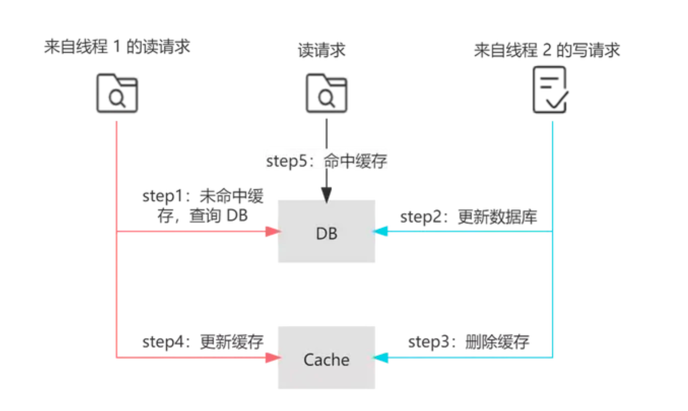
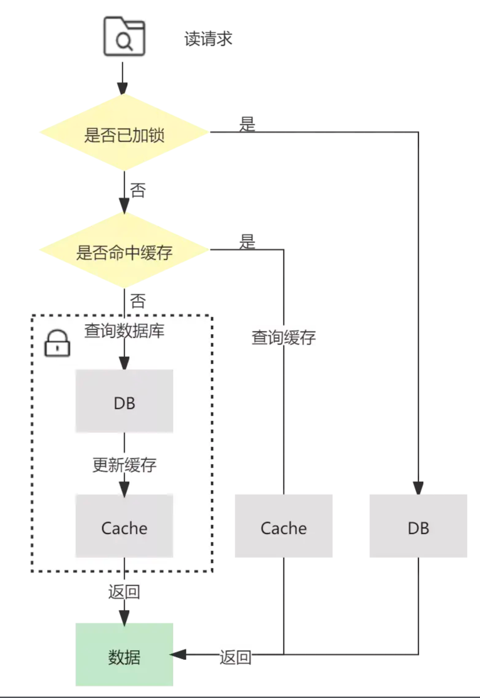

# 期待的来了 redis缓存和数据库的数据一致性解决方案   

* 使用策略共**三种**:  
  * 单节点：单例模式(加读写锁🔒)
  * 主从结点：
    * 延时双删（虽然有主从延时的问题存在，但是如果使用polarDB的话，基本就解决了）
    * MQ异步更新缓存（这个比较难，我优先实现前面两种）
* 使用go语言实现

---

## 话不多说直接开始
### 场景说明
&nbsp; &nbsp;  缓存数据我们使用体系树来实现。这是一个树状结构的数据，大家可以理解为评论区。
在评论区中我们可以看到一级评论，还能看到二级评论（也即有人在别人的评论下面继续评论），那个这个就是一个树状结构的数据。我们使用这样一个体系树来模拟读多写少的场景。    
&nbsp; &nbsp; 现在我们有一个下拉列表，这是一个树，对于接口请求我们需要将mysql存储的行数据封装成一个有层级关系的树（就是嵌套）。对于这个树的构建，我们需要使用DFS或者BFS来解决。
虽然这已经是n*log(n)的时间复杂度来构建了，但是在这个读多写少的场景下，频繁的建树和读表还是有点吃性能的，因为多次请求的情况下，这个树只有极低的情况才会更新，大部分情况下多次请求数据都是一样的。   
&nbsp; &nbsp; 所以我们就会很自然的想到使用redis缓存。当接口请求过来，我们优先查缓存，缓存存在我们就返回，返回不存在就查表更新。同时当体系树的数据更新了，我们有不同的策略对redis的缓存进行更新。   
&nbsp; &nbsp; 针对这个使用缓存的场景，我们有三种执行策略，分别是**读写锁的单例模式**、**延时双删策略**、**MQ异步更新缓存**。     
策略结果：   
&nbsp; &nbsp; 1. **读写锁的单例模式**：时延最短，一致性最高。 （只适用单结点，或者查表强制使用主库也是可行的）   
&nbsp; &nbsp; 2. **延时双删**：实现方式最简单，代码量最少。（数据库单结点或者阿里巴巴的polarDB 100%适用。但是对于搭建主从的数据库，双删的间隔时间设置为多少需要DBA确定）
因为主从库延时的时间是不确定的，如果间隔时间设置小了，那么查询体系树的线程依然会读到脏数据。    
&nbsp; &nbsp; 3. **MQ异步更新缓存** ：通过canal监听binglog 然后发送MQ异步消费，从而对redis缓存进行主动更新。这个思路目前是大部分场景的优解，主要得益于MQ的快速消费 和从主库拿数据一定是最新的。   
在同一个内网环境下，mq的发送和消费是很快的，通常比延时双删的间隔时间短的多，所以效果很好。但问题是，搭建这一套机制逻辑很复杂，设计两个中间件，需要考虑消失丢失的情况，所以并不是首选方案。

--- 

### sql 体系树脚本
&nbsp; &nbsp;  这个就是我们上面说到的体系树的sql脚本，你直接执行就好了

```sql
# 生成一个体系树🌲 每个层级都有一个父级的parent_id
# 所有的一级标签的parent_id都是1
# 这个脚本有30个一级标签 每个一级标签有5个二级标签 每个二级标签都有5个三级标签

CREATE TABLE label_tree (
    id INT AUTO_INCREMENT PRIMARY KEY,
    name VARCHAR(255) NOT NULL,
    parent_id INT DEFAULT NULL,
    level INT NOT NULL,
    FOREIGN KEY (parent_id) REFERENCES label_tree(id)
);

truncate label_tree;


DROP PROCEDURE IF EXISTS generate_label_tree;
DELIMITER //


CREATE PROCEDURE generate_label_tree()
BEGIN
    DECLARE i INT DEFAULT 1;
    DECLARE j INT DEFAULT 1;
    DECLARE k INT DEFAULT 1;
    DECLARE parent_id_level1 INT DEFAULT 1; -- 一级标签的 parent_id 设置为 1
    DECLARE parent_id_level2 INT DEFAULT NULL;

    -- 插入一级标签
    WHILE i <= 30 DO
        INSERT INTO label_tree (name, parent_id, level) VALUES (CONCAT('Label Level 1 - ', i), 1, 1);
        SET parent_id_level1 = LAST_INSERT_ID();

        -- 插入二级标签
        WHILE j <= 5 DO
            INSERT INTO label_tree (name, parent_id, level) VALUES (CONCAT('Label Level 2 - ', i, '.', j), parent_id_level1, 2);
            SET parent_id_level2 = LAST_INSERT_ID();

            -- 插入三级标签
            WHILE k <= 5 DO
                INSERT INTO label_tree (name, parent_id, level) VALUES (CONCAT('Label Level 3 - ', i, '.', j, '.', k), parent_id_level2, 3);
                SET k = k + 1;
END WHILE;

            SET k = 1;
            SET j = j + 1;
END WHILE;

        SET j = 1;
        SET i = i + 1;
END WHILE;
END //

DELIMITER ;


INSERT INTO label_tree (id, name, parent_id, level) VALUES (1, 'root', NULL, 0);

CALL generate_label_tree();

select * from label_tree where parent_id  =32;


```

--- 

### 两种情况
* **正常情况**

  1. 读请求发现cache不存在，就查DB更新缓存
  2. 写请求先更新DB，然后将cache删除掉。
  * 情况
    1. 此时读线程早于写线程的话，那么写入的是旧值，但是等待写线程完成后，读线程会马上再次更新cache，实现数据一致性。
    2. 读操作晚于写操作的话那么更没问题，拿的就是最新的数据。
    3. 如果读写同时发生，只要step-4早于step-3就没问题，因为旧数据会被删除掉。
* **坏情况**
  1. 如果读写同时发生，step-4晚于step-3，同时是查读DB的时候早于step-2，那么最后插入缓存的就是旧数据⚠️⚠️⚠️⚠️⚠️⚠️⚠️⚠️⚠️⚠️⚠️。
         1. ！！！！！！！
         2. 也就是读操作先查到旧数据，然后写操作更新DB，然后读操作将这个旧数据处理完之之前，写线程就已经将cache的key删除掉了，此时读线程最后将处理完后的旧数据上传到redis，此时就会出现问题。上传redis的数据不是新数据。
         2. 但是这种条件非常苛刻。不仅需要缓存失效且读写并发执行，而且还需要读请求查询数据库的执行早于写请求更新数据库，同时读请求的执行完成晚于写请求。但是并不是不存在！！！
  2. 我们这个体系树就会出现这样的情况，因为数据结构比较复杂，涉及到DFS/BFS，那么计算出这个数据结构的时间就会很长。此时如果写线程将某一个体系标签的名字改了，或者父级体系ID改了，那么就会出现这样的问题。因为DB的update操作O（1），时间很快。

这种情况其实用双删基本就解决了，双删的间隔时间设置为读操作接口的响应时间基本100%解决。
但是我们还是一个个列出来，嘿嘿😁😁😁😁😁😁

### 读写锁的单例模式
&nbsp; &nbsp; 在上面描述的问题中，如果要实现100%的一致性，我们可以使用分布式锁解决。在读DB的时候和改DB的时候追加分布式锁，保证更新操作和从DB读数据只有可能一个线程持有锁，从而保证数据的一致性。    
&nbsp; &nbsp; 看看图先：
* 写操作 变成序列化（注意⚠️这里锁的范围从DB到Cache，如果我们使用的Mysql的话，其MVCC机制帮我解决更新的问题，所以我们只需要对Cache的del操作加分布式锁就好了🔒）

* 读操作效仿 单例模式 进行双重验证并加锁（这里锁的范围必须是查DB到Cache set操作，保证更新线程的del和读线程的set是序列化的）
  * 如果读线程先获得锁，此时写线程更新DB，但是由于读线程持有锁，所以del操作阻塞，将不会存在先del 空键 后set 旧数据的情况。
  * 如果读线程分布式锁的范围变为set的时候加锁，那么存在读线程先读旧数据，写线程更新，然后写线程先获得锁，然后set最后插入旧值。这样问题依然解决不了。
  * 同时注意⚠️⚠️⚠️：这里读操作的范围从DB到cache的原因还有一个是：读操作流量大，如果不在这里加锁，那么会有多个读线程同时打入DB，这样DB肯定扛不住。
    这么多线程先查了数据，然后等待获锁🔒，最后发现cache 的key被多次set，造成不必要的资源浪费。
  * 这个时候我们还可以额外加入本地锁，防止一个实例的高并发读，然后分布式锁只用于多个实例的竞争。这样就分担了获分布式的锁的压力，不会是所有线程都在等待分布式锁的资源释放。

* 具体我是怎么写的，就看看这里吧[点这里进入！嘻嘻😁](./main/main.go)。这里我偷懒了，我直接将DB的update 和 cache的del锁在一起，偷个懒。嘿嘿
  * 我本地有一个锁，防止单实例的多线程竞争，然后使用redis分布式锁，防止多实例的竞争


### 延时双删策略
这个很简单，我过几天在写。这段时间看数据库去了。